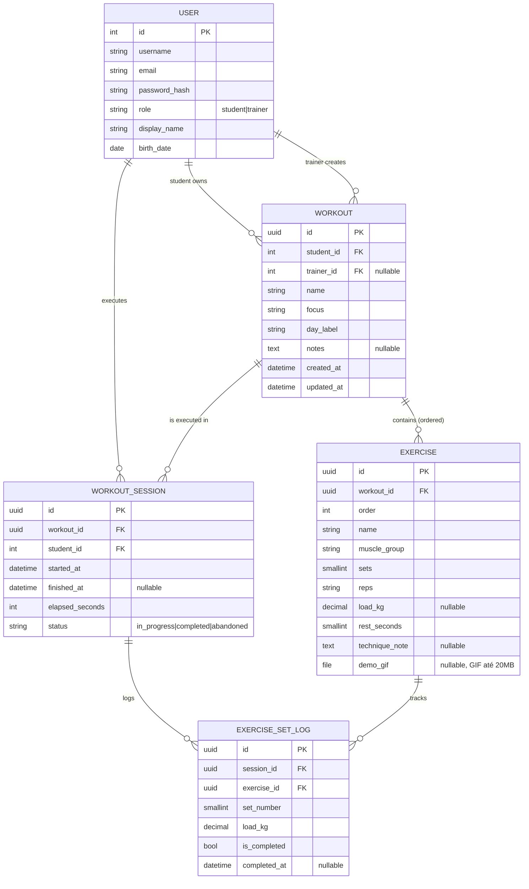

# Modelagem do banco — backend Django para o app `gym`

> Stack escolhida: **Django + PostgreSQL + JWT (djangorestframework-simplejwt)**
> Foco desta fase: **modelagem do banco** apenas. Endpoints e auth virão depois.

---

## 1. Resumo do projeto Swift analisado

App SwiftUI sem persistência real (apenas `SampleData` em memória + `UserDefaults` para flags). Login mock (`aluno`/`aluno`). Estrutura encontrada:

| Arquivo Swift | Papel |
|---|---|
| `Models/Workout.swift` | structs `Workout` e `Exercise` |
| `Models/SampleData.swift` | dados fixos de exemplo |
| `Views/LoginView.swift` | tela de login (mock) |
| `ContentView.swift` | lista das fichas da semana |
| `Views/WorkoutDetailView.swift` | detalhe de uma ficha |
| `Views/ExerciseExecutionView.swift` | execução do exercício, com séries e cronômetro |

Comentários relevantes que orientam o backend:

- `// TODO: trocar por dados vindos de um ViewModel/Repository` em `ContentView` → ponto de injeção de dados via API.
- `notes: String? // observação do personal` → existe a figura do **personal trainer**.
- `Saudação "Bom treino, Pedro!"` hardcoded → cada aluno deveria ter nome próprio.
- `SetEntry` é runtime e some ao sair da tela → faz sentido **persistir séries executadas** para histórico.

---

## 2. Decisões de modelagem

### 2.1 Usuários e papéis
O app já distingue **aluno** e **personal trainer** implicitamente (campo `notes` é "do personal"). Decisão final (atualizada na fase 2):

- **`User` custom** estendendo `AbstractUser` em `accounts.User` — `AUTH_USER_MODEL = "accounts.User"`.
- Campos adicionais direto no `User`: `role` (`student` | `trainer`), `display_name` e `birth_date`.
- Quando um trainer cria uma ficha, registramos o aluno (`student`) e quem criou (`trainer`) como FKs distintas.

> **Mudança em relação ao plano original:** considerei usar uma tabela `Profile` 1:1 com o User, mas adotei `AbstractUser` (custom user model). Motivo: é a recomendação oficial do Django para projetos novos, evita um JOIN extra em toda autenticação, e migrar `User` *depois* é dolorosamente complicado. Custom user no dia 1 é débito técnico zero. Alternativa rejeitada: tabelas separadas `Student`/`Trainer` — causa duplicação no auth e dificulta o caso de um usuário ser ambos.

### 2.2 Ficha de treino (`Workout`)
Mapeamento direto do struct Swift, com adições:

| Swift `Workout` | Django `Workout` | Notas |
|---|---|---|
| `id: UUID` | `id: UUIDField (PK)` | mantém UUID, o Swift já gera UUIDs |
| `name: String` | `name: CharField(100)` | "Treino A" |
| `focus: String` | `focus: CharField(120)` | "Peito e Tríceps" |
| `dayLabel: String` | `day_label: CharField(40)` | "Segunda-feira" |
| `notes: String?` | `notes: TextField(blank=True)` | observação do personal |
| `exercises: [Exercise]` | reverse FK em `Exercise.workout` | relação 1:N |
| — | `student: FK(User)` | dono da ficha |
| — | `trainer: FK(User, null=True)` | quem criou (opcional) |
| — | `created_at`, `updated_at` | auditoria padrão |

### 2.3 Exercício (`Exercise`)
Também mapeamento direto, mas adiciono `order` para preservar a ordem da lista (o Swift usa array; o banco precisa de campo explícito).

| Swift `Exercise` | Django `Exercise` |
|---|---|
| `id: UUID` | `id: UUIDField (PK)` |
| `name: String` | `name: CharField(120)` |
| `muscleGroup: String` | `muscle_group: CharField(80)` |
| `sets: Int` | `sets: PositiveSmallIntegerField` |
| `reps: String` | `reps: CharField(20)` (suporta "8-12", "AMRAP") |
| `loadKg: Double?` | `load_kg: DecimalField(5,2, null=True)` |
| `restSeconds: Int` | `rest_seconds: PositiveSmallIntegerField (default=60)` |
| `techniqueNote: String?` | `technique_note: TextField(blank=True)` |
| `videoURL: URL?` | `demo_gif: FileField(blank=True, null=True)` — **mudança da fase 3.1**: passou de URL externa para upload de GIF próprio do trainer. Validações: extensão `.gif`, máx 20 MB. No JSON da API aparece como URL absoluta pro arquivo servido pelo backend. |
| — | `workout: FK(Workout, on_delete=CASCADE)` |
| — | `order: PositiveSmallIntegerField` |

> Por que `DecimalField` em vez de `FloatField` para a carga? Cargas no app são números "redondos" (40 kg, 18 kg, 22.5 kg). `Decimal` evita problemas de precisão de ponto flutuante, e a UI Swift formata com 1 casa decimal.

### 2.4 Sessões executadas (novidade)
O `SetEntry` do Swift é **runtime** — ao sair da tela, o progresso some. Pra ter histórico, modelo:

- `WorkoutSession` — uma execução de um treino (timestamps, duração total, status)
- `ExerciseSetLog` — cada série feita: qual exercício, número da série, carga real, marcou como concluída

Isso é a base pro "histórico de treinos" que provavelmente virará feature.

### 2.5 Catálogo de exercícios? — **não agora**
Tentação: criar tabela `ExerciseCatalog` com nome canônico, vídeo, grupo muscular, e `Exercise` viraria FK pra ela. Vantagens: padronização, reuso, autocomplete no app do trainer.

**Decisão:** *adiar*. No estado atual o trainer escreve `name` e `muscleGroup` como string livre, e migrar pra catálogo é fácil depois (script de migração que extrai os distinct e cria FKs). Forçar agora cria fricção sem benefício imediato.

---

## 3. Diagrama ER



---

## 4. Schema PostgreSQL (DDL de referência)

> Esse SQL é só pra leitura humana. No Django, as migrations são geradas a partir de `models.py` (próxima seção). A tabela `accounts_user` é gerada automaticamente pelo Django a partir do `AbstractUser`, com os campos extras `role`, `display_name` e `birth_date`.

-- ficha de treino
CREATE TABLE workout (
    id          UUID PRIMARY KEY DEFAULT gen_random_uuid(),
    student_id  BIGINT NOT NULL REFERENCES accounts_user(id) ON DELETE CASCADE,
    trainer_id  BIGINT REFERENCES accounts_user(id) ON DELETE SET NULL,
    name        VARCHAR(100) NOT NULL,
    focus       VARCHAR(120) NOT NULL,
    day_label   VARCHAR(40)  NOT NULL,
    notes       TEXT,
    created_at  TIMESTAMPTZ NOT NULL DEFAULT NOW(),
    updated_at  TIMESTAMPTZ NOT NULL DEFAULT NOW()
);
CREATE INDEX workout_student_idx ON workout (student_id);
CREATE INDEX workout_trainer_idx ON workout (trainer_id);

-- exercício dentro da ficha
CREATE TABLE exercise (
    id              UUID PRIMARY KEY DEFAULT gen_random_uuid(),
    workout_id      UUID NOT NULL REFERENCES workout(id) ON DELETE CASCADE,
    "order"         SMALLINT NOT NULL DEFAULT 0,
    name            VARCHAR(120) NOT NULL,
    muscle_group    VARCHAR(80)  NOT NULL,
    sets            SMALLINT NOT NULL CHECK (sets > 0),
    reps            VARCHAR(20)  NOT NULL,
    load_kg         NUMERIC(5,2),
    rest_seconds    SMALLINT NOT NULL DEFAULT 60 CHECK (rest_seconds >= 0),
    technique_note  TEXT,
    demo_gif        VARCHAR(100),  -- caminho do arquivo no MEDIA_ROOT
    UNIQUE (workout_id, "order")
);
CREATE INDEX exercise_workout_idx ON exercise (workout_id);

-- sessão de execução
CREATE TABLE workout_session (
    id                UUID PRIMARY KEY DEFAULT gen_random_uuid(),
    workout_id        UUID   NOT NULL REFERENCES workout(id)   ON DELETE CASCADE,
    student_id        BIGINT NOT NULL REFERENCES accounts_user(id) ON DELETE CASCADE,
    started_at        TIMESTAMPTZ NOT NULL DEFAULT NOW(),
    finished_at       TIMESTAMPTZ,
    elapsed_seconds   INTEGER NOT NULL DEFAULT 0,
    status            VARCHAR(15) NOT NULL DEFAULT 'in_progress'
                      CHECK (status IN ('in_progress','completed','abandoned'))
);
CREATE INDEX session_student_idx       ON workout_session (student_id);
CREATE INDEX session_workout_idx       ON workout_session (workout_id);
CREATE INDEX session_started_at_idx    ON workout_session (started_at DESC);

-- log de cada série feita
CREATE TABLE exercise_set_log (
    id            UUID PRIMARY KEY DEFAULT gen_random_uuid(),
    session_id    UUID NOT NULL REFERENCES workout_session(id) ON DELETE CASCADE,
    exercise_id   UUID NOT NULL REFERENCES exercise(id)        ON DELETE CASCADE,
    set_number    SMALLINT NOT NULL CHECK (set_number > 0),
    load_kg       NUMERIC(5,2) NOT NULL,
    is_completed  BOOLEAN NOT NULL DEFAULT FALSE,
    completed_at  TIMESTAMPTZ,
    UNIQUE (session_id, exercise_id, set_number)
);
CREATE INDEX setlog_session_idx  ON exercise_set_log (session_id);
CREATE INDEX setlog_exercise_idx ON exercise_set_log (exercise_id);
```

---

## 5. Estrutura de apps Django sugerida

```
backend-gymapp/
├── manage.py
├── gym_api/                  # config (settings, urls, wsgi)
│   ├── settings.py
│   └── urls.py
├── accounts/                 # User extension + Profile + JWT
│   ├── models.py             # Profile
│   └── serializers.py
├── workouts/                 # núcleo do domínio
│   ├── models.py             # Workout, Exercise
│   ├── serializers.py
│   ├── views.py
│   └── urls.py
└── sessions/                 # histórico de execuções
    ├── models.py             # WorkoutSession, ExerciseSetLog
    └── ...
```

> Por que separar em 3 apps em vez de 1? Cada app cobre um bounded context distinto: `accounts` é genérico, `workouts` é o "catálogo" do treino, `sessions` é o "log" do que foi feito. Facilita evoluções (ex.: adicionar plano alimentar futuramente vira `nutrition/`).

---

## 6. Mapping campo a campo: Swift → API JSON → Django

Esse mapping serve de contrato pros endpoints futuros. Quando codarmos os serializers, eles emitem **exatamente** isso, e o lado Swift (`URLSession` + `Codable`) consegue decodificar direto pros structs.

### `Workout` (response do `GET /api/workouts/{id}/`)

```json
{
  "id": "9f8e7d6c-...-uuid",
  "name": "Treino A",
  "focus": "Peito e Tríceps",
  "day_label": "Segunda-feira",
  "notes": "Foque no controle excêntrico...",
  "exercises": [ /* ver abaixo */ ]
}
```

> O Swift hoje usa `dayLabel` (camelCase). No Django/DRF o padrão é `day_label` (snake_case). Resolvemos com `CodingKeys` no struct Swift OU configurando `JSON_NAMING_STRATEGY` no DRF. Recomendo o lado Swift se adaptar via `CodingKeys` — mais idiomático em REST.

### `Exercise` (item dentro de `workout.exercises`)

```json
{
  "id": "1a2b3c4d-...-uuid",
  "name": "Supino reto com barra",
  "muscle_group": "Peitoral",
  "sets": 4,
  "reps": "8-12",
  "load_kg": "40.00",
  "rest_seconds": 90,
  "technique_note": "Cadência 2-1-2",
  "demo_gif": "http://localhost:8000/media/exercises/<wid>/<eid>.gif"
}
```

---

## 7. Próximos passos (fora do escopo desta fase)

1. ✅ **Fase 1 — modelagem (esta entrega)**
2. ⏭ Fase 2 — bootstrap do projeto Django (`django-admin startproject`, configurar Postgres, `simplejwt`).
3. ⏭ Fase 3 — implementar `models.py` e rodar `makemigrations` + `migrate`.
4. ⏭ Fase 4 — serializers, views (DRF generics ou ViewSets), URLs.
5. ⏭ Fase 5 — endpoints de auth: `POST /api/auth/login/`, `POST /api/auth/refresh/`.
6. ⏭ Fase 6 — endpoints CRUD: `/api/workouts/`, `/api/sessions/`, `/api/sessions/{id}/sets/`.
7. ⏭ Fase 7 — adaptar o app Swift: criar `APIClient` com `URLSession`, `AuthStore` para o JWT, e substituir `SampleData` por chamadas reais.

---

## 8. Convenções e cuidados

- **Timezone:** banco em UTC (`USE_TZ = True` no Django). UI Swift converte para o fuso local.
- **Soft delete?** Não nesta fase. Se virar requisito (manter histórico de fichas removidas), adicionar `deleted_at` em `Workout` e ajustar managers.
- **Ordenação de exercícios:** garantida por `Exercise.order` + `UNIQUE (workout_id, order)`. Reordenação no app envia PATCH com a nova ordem.
- **Validações de domínio:** `sets > 0`, `rest_seconds >= 0`, `set_number > 0`, `status` em valores fixos. Tudo expresso como `CHECK` no SQL e `validators` nos models Django.
